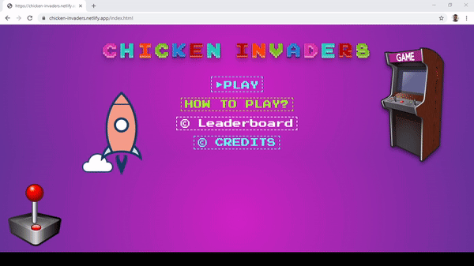
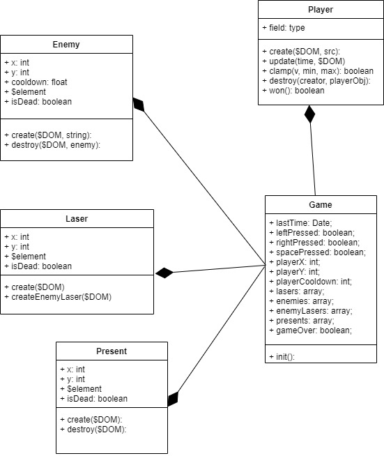

# Chicken Invaders Game


Gameplay :joystick: | Leaderboard :trophy:	
:-------------------------:|:-------------------------:
 | 

## you can view at :

[Chicken Invaders Game](https://chicken-invaders.netlify.app/)

## High-level Diagram :monocle_face:



## Folder Structure

```

├── README.md
├── about
│   ├── audio
│   │    └──spaceinvaders1.mpeg
│   └── js
│       └──about.js
└── css
    ├── App.css # Styles for instructions. Feel free to customize this as you desire.
    ├── home.css # Styles for index html file
    ├── leader.css # Styles for leaderboard html file
    ├──main.css # Styles for game html file
    ├──js
    │  ├──board.js #contains logic for leader-board
    │  ├──Config.js #contains the configurations for game loop
    │  ├──Enemy.js #contains the Enemy Class
    │  ├──Game.js #contains the Game Class
    │  ├──Helper.js #contains some Helper functions
    │  ├──home.js #contains player creation modal logic
    │  ├──Laser.js #contains the Laser Class
    │  ├──modal.js #contains the Pause modal logic
    │  ├──Player.js #contains the Player Class
    │  ├──Present.js #contains the Present Class
    ├── Images # Helpful images for the app. Use at your discretion.
    │   ├── egg.png
    │   ├── player-blue-1.png
    │   └── laser-blue-1.png
    ├──sound #contains the game sounds
    ├── game.html #the game loop ui
    ├── index.html #the home page ui
    ├── Instructions.html #the instructions ui
    ├── leaderboard.html #the leaderboard ui
    └── Main.js # You should not need to modify this file. It is used for the game main loop Logic.
```

### Enemy Class :chicken:

Is responsible for creating the chickens , the way they move , how they die and the time they shoot.

```
create($container, src)
```

This function is responsible for the chicken creation.

```
destroy($container, enemy)
```

This is function is used to destroy the chicken and removing it from the DOM.

### Present Class :tada: :poultry_leg:

This class is used to create roasted chicken and append it to the DOM when the chicken explodes.

```
create($container, src)
```

This function is used to create the roasted chicken and append it to the DOM.

```
destroy($container, enemy)
```

This function is used to remove the roasted chicken from the DOM if it is eaten by the space ship or when it hits the game border.

### Laser Class :boom:

is responsible for creating the player laser and enemy laser .

```
create(container):
```

it is responsible for creating player laser and pushing the created laser to the Laser array in the class Game.

```
createEnemyLaser(containers):

```

it is responsible for creating enemy laser and pushing the created laser to the enemyLaser array in the class Game

```

updateLasers(dt,containers):

```

it is responsible for moving player laser in right direction & check if the laser hit the enemy

```

destroyLasers(containers,laser):

```

it is responsible for destroy the laser and remove it from Dom

```

updateEnemyLasers(dt,containers):

```

it is responsible for moving enemy laser in right direction & check if the laser hit the player and decrease the lives if the collision is happened

### Player Class

Player class has implemented methods for creating the player, updating player position, destroying the player, and winning

```
create($container, imgSrc)
```

Creates a new player (Dom element)

```
update(dt, $container)
```

Updates the position of the player on the screen. It calculates the distance based on the physics law: distance=time\*speed.

```
destroy(container, player)
```

Removes the player, the DOM element, from the screen after getting hit by the enemy weapon (eggs).

```
won()
```

Returns true if all enemies are destroyed and no presents on the screen.

```
clamp(v,min,max)
```

Keeps the player on the screen limits and force the player not to Exceed them

### Game Class :joystick: :video_game:

```
init()
```

1. It is responsible for initating the game by creating all the enemies
2. Creates the Player
3. Handles the Spacing between the chickens
4. Handles the level logic
